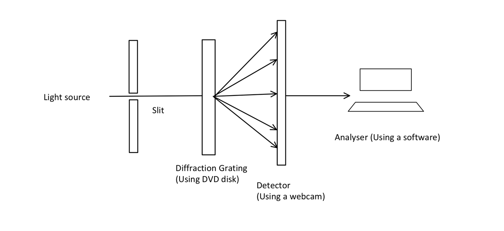
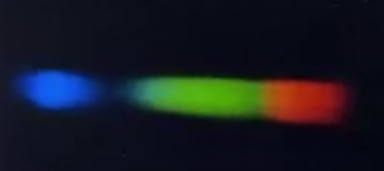
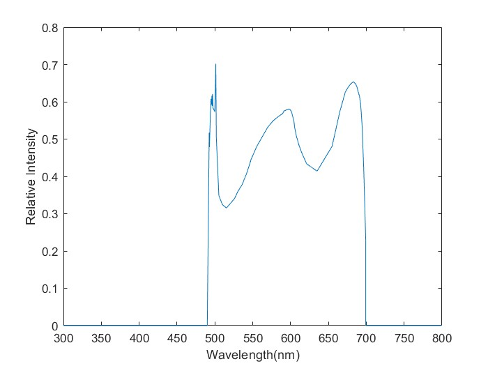
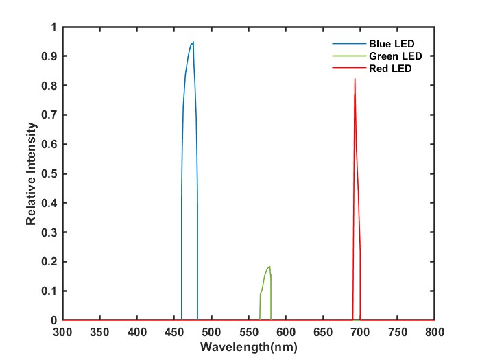
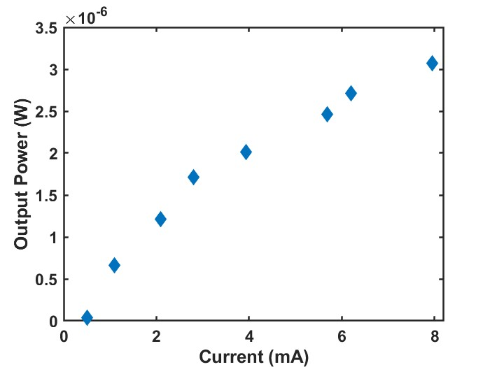
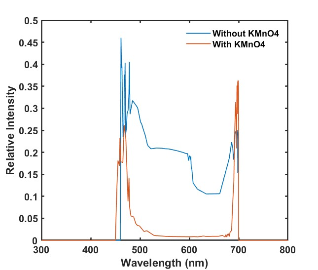
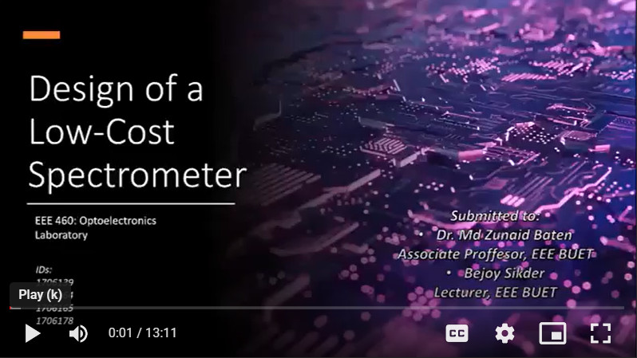

# Design-of-a-Low-Cost-Spectrometer

## **Components**
  1. Arduino Uno/Mega
  2. Webcam
  3. Disc
  4. Razor Blade
  5. Tape
  6. Black Paper
  

## **Block Diagram**
 

 

## **Spectra**
 

   

   

## **White LED Spectra**
 

   

   

## **Comparison of Red, Blue & Green LED Spectra**
 

   

  

The intensity of green led was very low which gets reflected in our designed spectrometer.

 

## **LI Curve**
 

   

   

## **Application: Beer-Lambert Law**
 

Our designed spectrometer can be used to determine the unknown concentration of a chemical solution using Beer-Lambert Law. The result is shown here. The experiment is conducted using white light and KMnO4 solution. White light gets absorbed most in the green wavelength range. The concentration can be measured by determining the absorbance ratio.

 

   

   

## **Project Demo**

 

## **Contributors**
1. Md. Tasnim Azad
2. Fahim Faisal
3. Aurick Das
4. Abhishek Das
